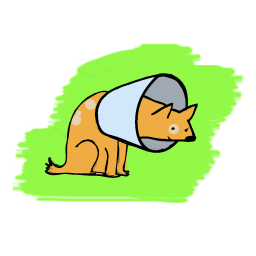
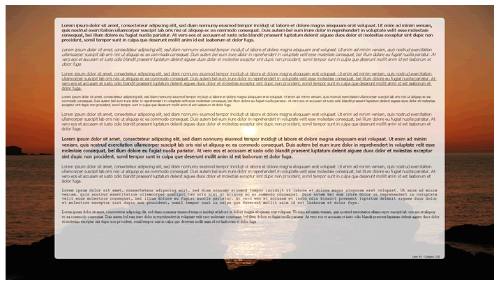
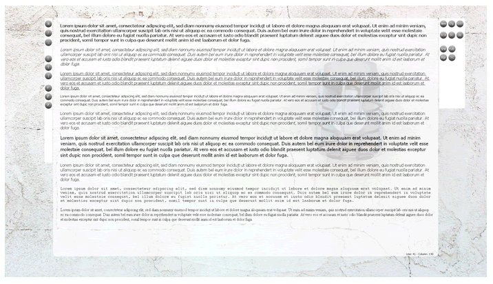
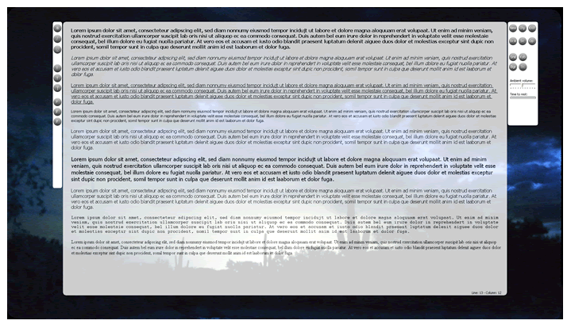
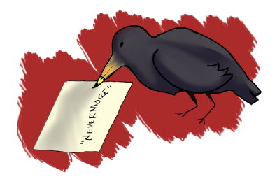
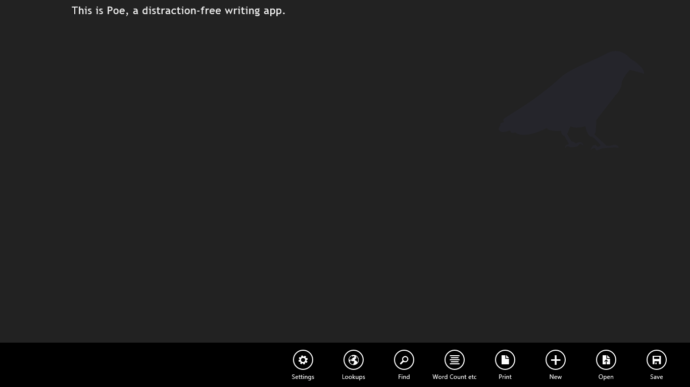
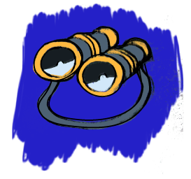
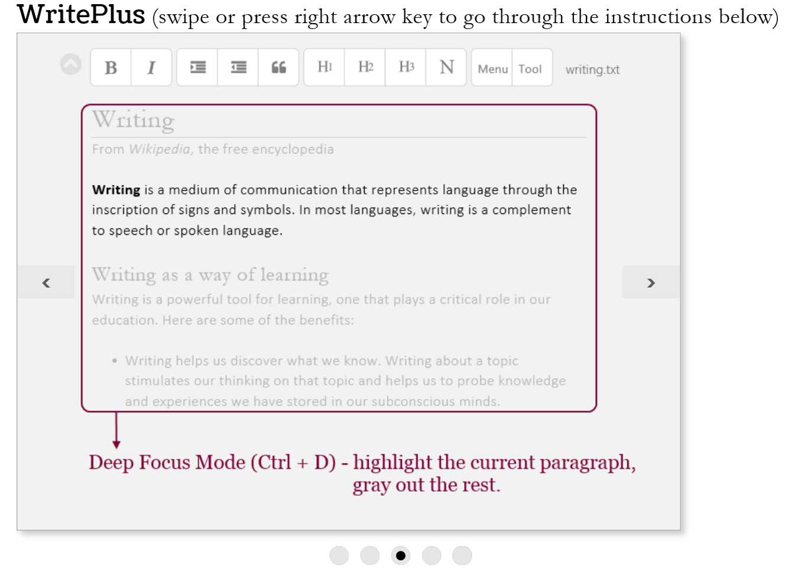
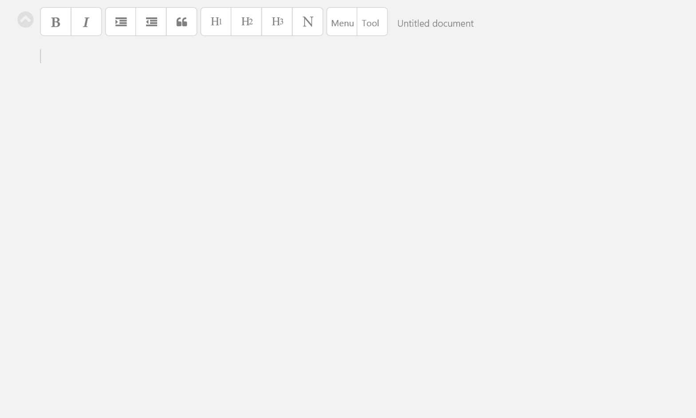

# Apps for PC

\

## Specimen 1: CreaWriter
Ginger Ohlemacher

\

- **Use:** Writing—equipped with tools to inspire writers as they write, yet free of distraction and most formatting
- **Cost:** Free or donation-based versions (recommended $12.49, but no less than $6.24)
- **Developer:** SPL
- [Website](http://www.creawriter.com/)

### Basic Knowledge

CreaWriter is a distraction-free writing program that lets users modify their writing environment to best suit their needs. It offers many of the same features as Microsoft Word that allow users to edit, format, and save their work as they would normally, but without the distraction of other programs, a toolbar, or margins. CreaWriter is simply the writer and the work. For people who have trouble focusing, or get distracted easily, this program is best for them. It is a full-screen program that creates a calm and distraction-free environment for writing.
Characteristics

#### Free Version:

- **Background music:** configurable ambient sound
- **Background image:** configurable and transparent
- **Font:** three different styles
- **Date and time:** able to insert into the document 

#### Purchased Version:

- **Text styles:** an increased selection of font choices and styles
- **Hotkeys:** series of key codes that offer quick access to a particular function
- **Autosave:** automatically saves the users’ work
- **Background:** user can determine the color and the transparency
- **Word count:** counts the words in the document
- **Background Music:** configurable ambient sound and volume
- **Audible keyboard:** offers to record spoken words
- **Keyboard sounds:** able to be changed
- **Timer:** suggests breaks for the writer
- **File support:** for RTF and TXT files

### Adaptations

CreaWriter does live up to what it promises to do: it blocks out all of the surrounding world (and it's even better with headphones!). This application is a really good tool if the user just wants to sit down and write. When users are in the application, nothing can come between them and their work so they could be writing for hours, which is why the paid version of the application comes with a break timer. Users can set the timer to remind them to take a step back and take a break from their work (they can always come back to it later). Users can also set the timer to go off at different intervals to suit their writing style.

CreaWriter is fairly customizable. Even the free version of the application still allows users to modify the interface enough to make it fit their writing needs. Don’t want to look at a picture of a beach? Change it! Don’t like listening to crackling fire? That can be changed too. CreaWriter even allows the user to turn off the image altogether and type while looking at a white screen. If the user finds white to be too boring, they can change the color of the text box to something more appealing. Also, there are three different font sizes to accommodate all types of users. Even the keyboard has sounds, which can (of course) be turned off if they are found to be bothersome.

CreaWriter takes away all the fancy (and distracting) features that come with Microsoft Word. There are no margins, spacing options, or page layouts to worry about. The application only allows the user to put words in bold, italics, or underline. This keeps writing simple, but still allows some formatting should the user be working on a more creative piece.

\ \ \

### Vulnerabilities 

If the user wants to do serious work for school or they need to edit something, this is not the tool. CreaWriter does not check spelling as the user writes, nor does it check grammar. This can be good if they just want to write, but there is no feature to go back and check for it later, which means they do have to move the file into Microsoft Word in order to edit.

The application does not count words or pages (unless the user pays for it), which can be kind of annoying if they’re writing to hit a goal. The users could write for hours and not know if they have one page or twenty, and if they’re writing a small blurb for a blog or a class there is no way to count the number of words they’re writing without moving it into another application.

Another problem with this application is that the cursor suffers from some sort of glitch. If users are lucky, they’ll have a nice blinking, black cursor to help them get their work done and help them keep track of where they are. However, this doesn’t always happen; sometimes the cursor does not pop up at all. If this were to happen, writing within the text would not be hindered, but the user would not be able to see where they were in the text.

Overall CreaWriter is not an application that is going to replace Microsoft Word, but rather it supplements it. CreaWriter's most central feature is that it is a full screen application that blocks out distractions, but that seems to be a double edged sword in this case. Perhaps CreaWriter does too good a job of blocking out the rest of the user’s computer. There is no way to minimize the program. The user either has it open (and taking up the whole screen) or they save their work and exit (there is no autosave, so users need to make sure they save their work). While the whole point of the program is to do away with distractions, it would be nice to check an email or two without having to shut down the entire program.

### Compatibility 

For people that have trouble focusing, or get distracted easily, this program is a must. It is a full-screen program that creates a calm and distraction-free environment to write in. If someone is working on a creative piece, journaling, or simply wanting to get their thoughts down on the page, this program is exactly what they’re looking for. CreaWriter lets users get all their thoughts down on the page without having to worry about anything at all, not even the time.

### Observed In The Wild By:

Ginger Ohlemacher is a Professional and Creative Writing double major. She one day hopes to earn a Ph. D. in Creative Writing and to live to be 106. 

## Specimen 2: Poe
Kathleen Harris

\

- **Use:** Writing, deadlines and goals, NaNoWriMo
- **Cost:** Free
- **Developer:** Rory O'Kelly
- [Website](http://roryok.com/poe/)

### Basic Knowledge

Poe is a writing application developed by a writer for writers. The developer, Rory O’Kelly, states that his role as a writer lends him the ability to understand what writers want out of their writing software.

\

O’Kelly created Poe to be a distraction-free place to record one’s words—“distraction-free,” alluding to the sleek black screen that offers the sight of nothing but the words the user types (which appear in white). The app is an easy-to-use alternative to the standard writing software offered by Windows.

### Characteristics

- **About Page:** offers keyboard shortcuts and may act as a sort of tutorial or guide for first-time users
- **Spellcheck:** uses the powerful spellcheck functionality of Windows 8
- **Autosave:** automatically saves every 60 seconds in case of a crash or accidental closure
- **Text Formatting:** customize text size and width (an all-or-nothing procedure; the entire document’s font shifts as a whole to become either smaller or larger)
- **Toolbar:** hidden from view to comply with “distraction-free” environment (can be accessed by right-clicking); contains the following tabs:
    - **Settings:** grants the user the ability to change the theme from white font on a black screen to either a grayscale or black-and-white design; also gives the user the ability to hide the logo from the screen (though some find its presence inspiring) where text formatting takes place
        - **Lookups:** acts as an instant connection to websites like Dictionary.com, Thesaurus.com, and Wikipedia (an internet connection is necessary for this tab to be helpful)
        - **Find:** allows the user to look up any words in the document
        - **Word Count:** keeps track of how many words are in the document total; also details how many words have been added in each new session since the last save; allows the user to set a word count goal and features a timer which allows the user to set a time limit for the session.
        - **Print:** print a document
        - **New:** add a new document
        - **Open:** open a saved document
        - **Save:** save a document  (several documents can be stored at once)
Rory O’Kelly will also be releasing a paid version of Poe (as he says, hopefully in December). The paid version will include new features: Rich-Text editing, cloud backup, chapter detection, document versioning, and more. The price of this app has not been released.

### Adaptations

Poe’s biggest strength is its accessibility. The app greets each new user with a black screen, occupied only by the app’s raven logo. 

This first look at the app can be somewhat intimidating, but once the user begins typing and exploring the app’s possibilities, it becomes evident that all the necessary features are well within reach.

Aside from the distraction-free design of the app, the most helpful feature for writers is the word count tab. The ability to set a goal and timer is appealing to writers that need to make a deadline and those that wish to track their progress. This feature also tracks several different word count types—from the total amount to how many words have been added this session to how many have been added since the last save—offering users a variety of ways to think about the growth of their writing.

### Vulnerabilities

The nature of the app as being “distraction-free” allows the toolbar to be hidden from view. It is hidden so well it is actually a bit hard to find. One doesn't quite know what to do with the app once it is open. In order to find out all that Poe offers, the user must right-click so that the toolbar will appear from the bottom of the screen. It’s nice to have the ability to hide this possible distraction from view; however, finding it initially can be quite frustrating.

In an attempt to offer some of the classic features of Microsoft Word, Poe has a collection of links that act as an instant connection to websites like Dictionary.com, Thesaurus.com, and Wikipedia, just to name a few. Helpful hint: an internet connection is required for this tab to be useful. In other words, for writers to even make use of this feature they would have to leave the app altogether—so why bother having the links in the app at all? The sentiment is nice, but the functionality is a bit off.

It is important to keep in mind that Poe is simply a place for users to record their words; this app is not made for formatting. Poe does not allow the user to bold or italicize words, and specific words or phrases cannot be singled out for reformatting. If the user wants to change the color or size of one word, all of the words must be changed. While this is not necessarily a hindrance, it is certainly something to keep in mind.

### Compatibility

Poe is a useful tool for users who may be participating in National Novel Writing Month (NaNoWriMo) and are looking to make deadlines within their work. The app would also be very useful for any writer who just wants a distraction-free place to record her words. Poe is ideal for any writer who wants to write and not worry about formatting just yet—there are other apps for that.

### Observed In The Wild By:

Kathleen Harris is a Professional Writing and Creative Writing double English major. Yes, she enjoys writing short fiction, reading her peers' unpublished manuscripts, and a long list of other nerdy things.

## Specimen 3: WritePlus
Allison Gnaegy

\

- **Use:** Distraction-free writing, unformatted writing, journaling, drafting blog posts
- **Cost:** Free or $3.99 for premium version
- **Developer:** Zig HM
- [Website](http://apps.microsoft.com/windows/en-us/app/writeplus/486f8570-1758-4563-b89f-c8923f50182d)

### Basic Knowledge

WritePlus is a text editing application for Windows 8.1, and is most friendly on the Microsoft operating system. The minimalist interface and basic formatting settings provide a distraction-free environment. The application supports export to .txt, .rtf, .pdf and .doc files. WritePlus is available as a free version and a premium version, which unlocks additional features. When launched, the WritePlus application presents the user with a screen of instructions.

When the user right-clicks anywhere within the application, they are presented with two control bars: one at the top featuring recently saved or currently open documents, and one at the bottom that allows the user to save the current document or open a new one, or print from within the application.

WritePlus supports opening .txt and .rtf formats, but the free version only supports .txt.

\

### Characteristics

- **“Deep Focus” Setting:** feature that dims out all of the document except the line or paragraph the writer is currently working on
- **Text Formatting:** user can mark text as bold or italic and is able to create headings, block quotes, and bullets; font size can also be changed to suit the user’s preference; WritePlus has also recently been updated to support copying and pasting
- **Themes:** offers “light” and “dark” theme displays
- **Word Count:** keeps track of how much progress has been made
- **Spell Check:** identifies common spelling and grammatical errors
- **Text to Speech:** reads the user’s text aloud
- **Resources:** offers a built-in dictionary and thesaurus
- **Printing:** user can print from within the application (free users will have a WritePlus watermark spread across the page)

\

Premium features of WritePlus include the ability to make a word cloud, saving the document in .pdf and .doc formats, and printing without a watermark across the page. Premium users can also export to HTML.

### Adaptations

The WritePlus interface is the app’s biggest strength. There are no colors within the application unless using the top or bottom toolbars, which disappear when not in use. The ability to change the theme from a light screen with dark text to a dark screen with light text is useful when switching between writing during the day and writing at night.

The “deep focus” feature is also incredibly beneficial, as it helps users narrow their focus to a specific portion of the text. This feature is particularly useful when writing anything extensive, as multiple-page documents can become overwhelming in Microsoft Word.

### Vulnerabilities

This is a simple text editor, so users looking to write code need to use a different application to preview their work. None of the formatting effects are supported in .txt format files, but WritePlus does use hashes, asterisks, and underscores to show that there is formatting on the text. Premium users can also save in .rtf, which eliminates this issue. When the user opens the saved .txt document using WritePlus, it accurately decodes its tags back into the format the user originally set them in within the application, including headings, bold text, etc., meaning WritePlus understands the tags it saves in the .txt file.

### Compatibility

WritePlus is the perfect application for writers who need to get some words down, without spending a lot of time on formatting. The application does not force the user to make a lot of decisions before they can begin writing in the way that Microsoft Word does. The application is also useful for drafting blog posts and journal entries that do not require intense formatting.

### Observed In The Wild By:

Allison Gnaegy is double majoring in Strategic Communication and Professional Writing. She enjoys working in the field of digital engagement, specifically social media marketing.

