# Hybrid Apps

\

## Specimen 1: Calmly Writer
Chelsea Yarbrough

\

- **Platform:** Mac, Windows, PC Linux, and Chrome OS or web 
- **Use:** Distraction-free writing
- **Cost:** Free
- **Developer:** Yusef Hassan
- [Website](http://www.calmlywriter.com/)

### Basic Knowledge

Calmly Writer is an app made for distraction-free writing. As soon as the user starts to write, everything disappears. There are no toolbars or margin measurements. There is not even a tab at the top. It’s just the user and the page.

### Characteristics

The features of Calmly Writer are simple and clean:

- **Dark Mode:** This workspace setting features a black page and white text. When writing in low-light environments, Dark Mode is easy on the eyes. 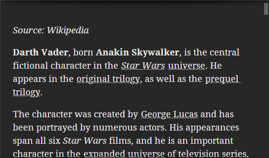\
- **Focus Mode:** Paragraphs that are not being worked on fade to a light gray without disappearing. The current working paragraph becomes the writer’s focus.
- **Responsive Design:** The application automatically adapts the layout to changes in the workspace size for the best view. 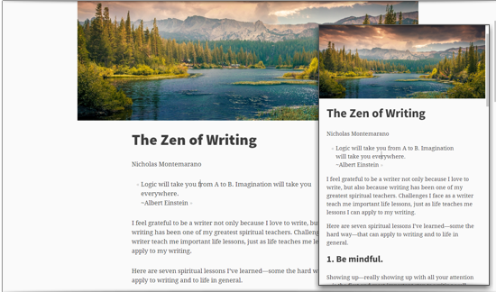\
- **Spell Check:** Available on the desktop version, spell check uses Google Chrome’s built-in spell checker. The web version supports spell check only on browsers with this capability.

### Adaptations

This application’s design is its biggest strength. The simplistic design was meant to focus the user on their writing, and it does just that. Calmly Writer creates a zen-like environment for writers. Advancements in technology took away much of the intimacy that writers get with their work, and Calmly Writer has brought it back with its distraction-free writing space. All the regular text formatting options are there to use, they are just hidden from view when writing.

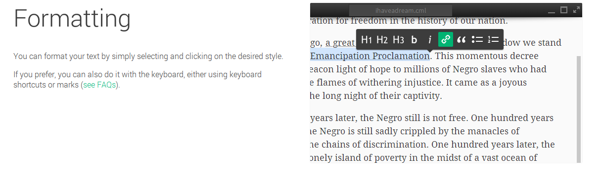\

### Vulnerabilities 

One issue with Calmly Writer is saving documents. Files are saved in CML format, which is essentially an HTML file. Calmly Writer can import Microsoft Word .docx files, but it can only export in HTML, plain text, Markdown, and PDF formats.
Compatibility 

Calmly Writer is best used as an editor and a place for writers to go if they find themselves distracted in other applications. This application can’t replace Google Docs or Microsoft Word. However, it does offer a place to edit and write in plain text, and the user’s work can be exported as a PDF when a PDF converter is installed. Calmly Writer is the perfect environment to get the creative juices flowing and to home in on editing and writing.

### Observed In The Wild By:

Chelsea Yarbrough is graduating in December 2014 with a Bachelor's in Creative Writing. She enjoys writing of all forms and challenges herself with different forms.

## Specimen 2: Evernote
Brian Robben

\

- **Platform:** web, but also compatible with mobile devices
- **Use:** Note-taking and collaboration
- **Cost:** Free, premium version $5 per month, business version $10 per month 
- **Developer:** Evernote Corporation
- [Website](http://www.evernote.com/)

### Basic Knowledge 

The goal of Evernote is to give users an all-inclusive workplace where they can remember everything. This free product is a place to focus and write without distractions, organize and collect information, and then share that information. Users utilize Evernote to save time and increase efficiency. The company targets its product to a wide audience, from freelancers to mega-corporation project teams.

Users can download Evernote to their desktop and will not need wifi to use the application. Users can also manage Evernote on their cell phone or tablet.

One way this application stands out from other word processing programs is that Evernote is an actual company. Evernote was valued at $1 billion dollars and plans for an IPO (initial public offering, or a stock market launch). This means that Evernote is reliable and can be trusted—there is no fear that the word processor will go out of business from a lack of funding.

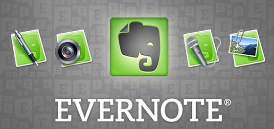\

### Characteristics 

- **Creating a new document:** Evernote makes it super easy to start a new note and the simple, plain format is designed to increase productivity.
- **Saving pictures and audio recordings:**  Evernote allows users to upload pictures. These pictures can be screenshots of interesting article titles or pictures that are needed to put together a business project. A similar function is available to save audio recordings.
- **Installing a Web Clippers:** Instead of making screenshots and letting these files ruin the organization of your desktop, use Evernote’s Web Clipper feature to collect any image, article, or text.
- **Searching notes and pictures:** For users who struggle to remember the details of pictures they previously saved, Evernote can actually search the image for text. Of course, the basic search function for files is also available.
- **Attaching files:** Through Evernote, there is no need to attach a PDF or Word file through email to communicate with your group members. Instead, use Evernote’s attaching files capability to progress a group project with good communication.
- **Syncing and recovering:** When using a note or other feature, Evernote can immediately sync to the Internet with a click of a button. When users need to find the note, Evernote’s search button can find documents by body text, even if a user cannot exactly remember the title.
- **Sharing capabilities:** Evernote allows users to share notes, pictures, or audio files with collaborators. 
- **Setting reminders:** If users cannot remember their schedules, Evernote has the capability of storing to-do lists and giving reminders. Again, this feature aids the user to focus on more important tasks that require more attention.

Evernote also includes a premium package, which includes many bonus features: automatic slide builder, increased monthly upload capacity, a PIN-lock for extra security, and technical support from the Premium help team.

### Adaptations

Evernote does tedious tasks (such as uploading files, finding files, saving pictures, giving reminders, etc.) so the user can focus on important tasks. Also, the application is accessible on all major browsers and smart phones. This widespread usage will help users manage their responsibilities in Evernote whether working at the office, at home, or while traveling (the offline mode makes this aspect much easier, especially when abroad). Evernote is extremely reliable and useful for people working for themselves and in a group.

With wifi, every note will sync from smartphone to computer. For example, people have even used Evernote as a tool to save receipts. It is no longer necessary to stuff wallets or purses with receipts, simply take a picture and add it to the Evernote notebook.

### Vulnerabilities 

When writing a note, the interface has the bare minimum of requirements for formatting a document, and certainly lacks the expansive formatting features (columns, borders and shading, drop cap, etc.) offered in Microsoft Word. For example, if a brochure needed completion, a user should choose Microsoft Word over Evernote. For users who need special formatting, Evernote is most definitely behind the competition.

Another weakness actually comes from one of Evernote’s advantages—there are so many features that the user may initially be overwhelmed. The fact that a five-step tutorial is provided shows that the system is complex and may be difficult until users become familiar with the application.

### Compatibility 

Evernote works with all platforms and devices, and the audience growth has soared because of this fact. So whether used with Safari, Google Chrome, or Internet Explorer, Evernote will work to its full capability. Also, for mobile devices, Evernote works on Apple products, Android, Blackberry, and Windows Phone.

### Observed In The Wild By:

Brian Robben is a writer who enjoys writing about the intersection of people and money. He is from Cincinnati, OH.

## Specimen 3: Intellinote
Rachael Osborn

\

- **Platform:** Android, iPhone, iPad, Mac, mobile web app, RIM-Blackberry, web, Windows devices
- **Use:** Note taking and collaboration
- **Cost:** Forever free for teams of up to 5 professionals; plans start at $10 per month per user for larger teams (pre-paid plans available), discounts for nonprofits, educational institutions, religious organizations
- **Developer:** Toni Lopresti, William Welch, and Gene Sohn
- [Website](http://www.intellinote.net/)

Everyone is looking for the newest and simplest ways to collaborate. Whether collaborating on a class project or in a small business, people are looking for the best methods of working together without working next to each other.

Enter, Intellinote: a collaborative note-taking app, which may be the solution to this dilemma.

### Basic Knowledge 

The goal of Intellinote is to give groups a space for collaboration through note-taking and task-assigning. It prides itself on being the total package: a place for notes, tasks, projects, files, discussions, workspaces with sharing and collaboration, and Google integration. Further, Intellinote can be accessed on a variety of devices. Intellinote mobilizes productivity with its ability to be used on various devices. Upon joining Intellinote, the user has both personal workspaces and shared workspaces. A student may use the workspaces for taking notes in each of his or her classes. A business manager may use the workspaces to oversee the progress of various projects. Workspaces host the users’ list of notes and tasks and can be given a goal or description. Notes is a very simple word processor with basic capabilities. Tasks are only available when doing collaborative work, but they allow users to assign responsibilities to different team members.

### Characteristics 

- **Workspaces:** Everything is organized in a workspace: notes, tasks, calendar, and notifications. Users have personal workspaces, which only they can see, and shared workspaces, which they invite other users to view. A student may have a workspace for each class; a business owner may have a workspace for each project or department. 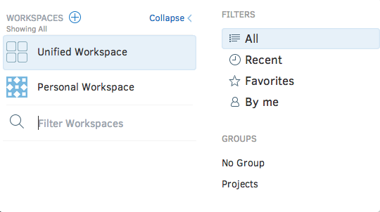\
- **Organization:** Work is organized through color coding and tags.
    Calendars: Intellinote provides calendars within workspaces to help keep track of deadlines.
- **Connect:** Users are able to attach files such as images and PDFs from their computer or Google Drive or send notes and tasks via text messages, email, Twitter or Facebook.
- **Intercommunication:** Users can leave comments or have discussions on other users’ progress.
- **Notifications:** Intellinote alerts the user when tasks within the group are assigned or completed.
- **Mobile app version:** A mobile version is available for download onto any mobile device. Photos from these devices can be directly uploaded to the app.

### Adaptations 

Since Intellinote’s primary functions are note-taking and collaboration, the apps serves both functions well. The available formatting options are basic, but sufficient. The vast amount of resources a user can bring into their workspaces is incredibly helpful. A student taking notes in class can attach links, images, PowerPoints, among other class resources.  The user can have an unlimited number of workspaces and include unlimited participants in each workspace. The collaborative capabilities are infinite. One particular strength is Intellinote’s intercommunication. 

Users can leave comments within a Note or have outside Discussions. These methods of communication keep conversations organized and separated from the content of the Note. Nearly any kind of file can be attached, either in a Note or in a comment. Intellinote is also supported on multiple devices—computer, tablet, mobile, etc. The app translates really well from device to device. The mobile app is not a watered down version, but fully supports all features.

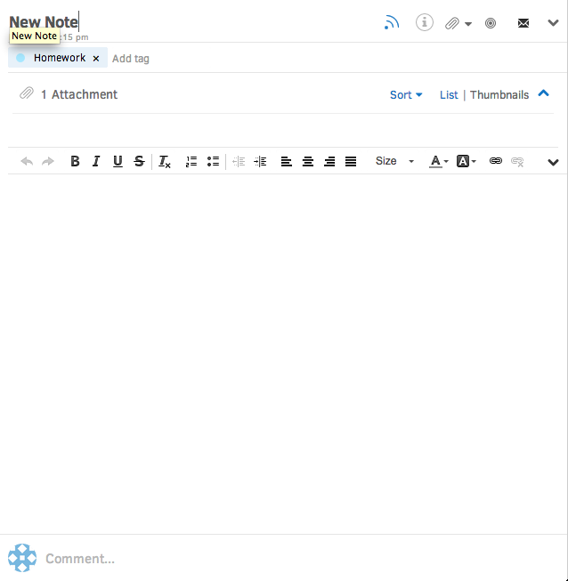\

### Vulnerabilities 

The interface and concept of collaboration are very similar to Google Drive and Evernote, though Intellinote claims to do it better. For a user with no interest in collaborative work, Intellinote does not offer much to set it apart from other note-taking apps. By not taking advantage of these collaborative capabilities, the user misses out on the app’s greatest strength. With the capability to attach items from Google Drive, or start Google Docs, Intellinote might seem like a redundant app since it is drawing on what Google already does. The organizational features of Intellinote are helpful but not outstanding. Additionally, the word processing and formatting options are limited. Tasks are only available in shared workspaces. It would be beneficial to have tasks in the personal workspace to create to-do lists or reminders.

### Compatibility 

Since Intellinote’s strengths are found in its collaborative power, businesses of all sizes or nonprofit organizations would benefit from the app’s capabilities. Intellinote does not limit the number of people in a workspace, so a major corporation could include all of its employees in a project. Additionally, since Intellinote is free for small teams, small businesses and organizations would be more inclined to use the app. Because collaboration is Intellinote's main attraction, individuals who are using the app for solo purposes are not able to enjoy or utilize all of its capabilities.

### Observed In The Wild By:

Rachael Osborn has a double major in Professional Writing and Sustainability and a minor in Community-Based Leadership. She prefers reading to writing, sandals to socks, and will always be forever free.

## Specimen 4: LibreOffice
Stephen Casey

\

- **Platform:** Mac, PC, web
- **Use:** Word processing needs
- **Cost:** Free
- **Developer:** The Document Foundation
- [Website](http://www.libreoffice.org/)

### Basic Knowledge

LibreOffice is an open source application that allows users to create written documents, slideshows, spreadsheets, and even draw freely within a page. It is designed for easy accessibility and is easy to master. When first opening up LibreOffice, it has a very similar feel to some Microsoft products such as Word, Excel, and PowerPoint. This is something that many users will like about this application. The similar feel makes it an easy transition for loyal Microsoft users.

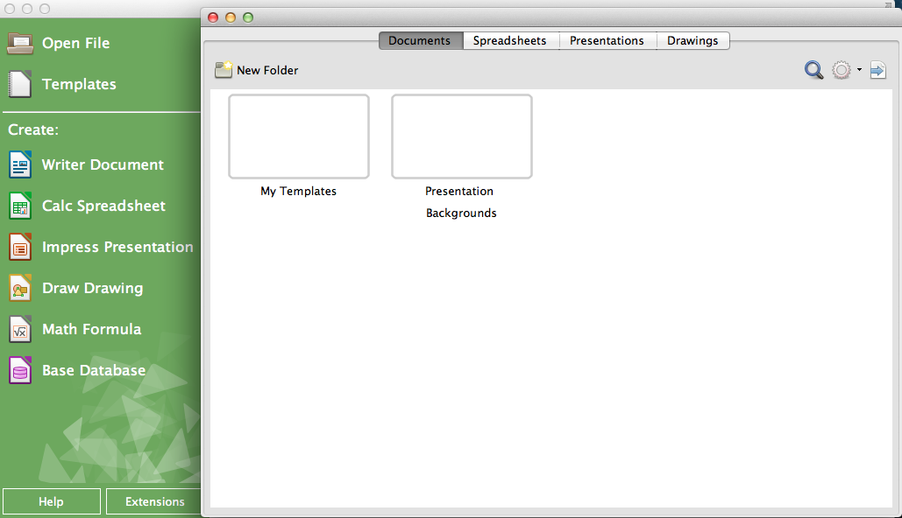\

### Characteristics

- **Multiple project platforms:** The user is able to choose between working in text documents, spreadsheets, presentations, a drawing section, and a database section.
- **Database:** The user has the ability to store an unlimited amount of information into a single space within LibreOffice. Users can then register their database.
- **Enhanced drawing sections:** Users have the ability to draw and create images as if they were a graphic designer. The draw section allows users to create large posters, flyers, and even 3D designs. The users have a lot of space to utilize as the page size in draw is 300 cm by 300 cm.

### Adaptations

One strength is the app’s accessibility and its easy-to-navigate pages. Users are able to jump right into a project without having to push their way through any unwanted pop up screens or tutorials. Additionally, all of the features have the same look and feel as the Microsoft Word application. This is a strength for users switching over from any Microsoft product because it will be easier for them to maneuver within the application.

### Vulnerabilities

When it comes to weaknesses of LibreOffice, there were not many. Some users complained of crashes when many documents were open at one time. Other users found that the draw portion of the application was occasionally unresponsive. The rest of the features and sections of this app were easy to manage and navigate, but the draw section proved to be confusing. It would be nice if there were a tutorial that offered step-by-step instructions on how to navigate this particular section. 

One last weakness that users ran into was the database section. To use this section, users need the latest version of Java. Doing so often requires users to quit and relaunch the application.

### Compatibility

This application can be suited for many different types of users—from casual users who only need to type up a quick paper to firms who need to design large posters. This is a very diverse app and anyone who knows how to use a computer would benefit from it. Even though LibreOffice has a very similar feel to Microsoft Office, it is a nice change of pace for anyone looking to break away from Microsoft products.

### Observed In The Wild By:                     

Stephen Casey enjoys creative writing and is an avid moviegoer. He is currently studying Strategic Communications at Miami University.

## Specimen 5: OmmWriter
Jack Dahm

\

- **Platform:** Mac, PC, iPad
- **Use:** Freewriting, creative writing
- **Cost:** $4.11 minimum
- **Developer:** Herraiz Soto & Co.
- [Website](http://oomwriter.com/)

### Basic Knowledge

The OmmWriter Dana app offers a getaway for writers where they can put aside distractions and focus on the singular task of writing. The app encourages concentration and creativity through a simple interface with stimulating visual and audio features. In the developers' words, "OmmWriter is your own private writing room where you can close the door behind you to focus on your writing in peace." The OmmWriter app is available for Mac, PC, and iPad.

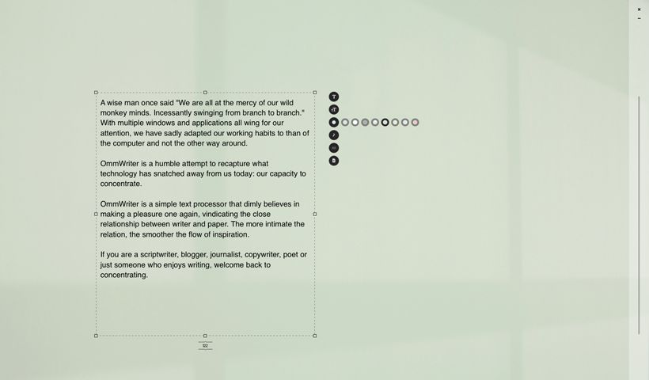\

### Characteristics 

OmmWriter offers three key features:

- **Backgrounds—"to hold your attention and set your mood":** There are eight background options, ranging from soft, solid colors to simple scenes of nature.
- **Audio Tracks—"to focus your mind on your words":** There are seven audio track options, each featuring natural, soothing sounds. There is also the option to write with no audio track.
- **Keystroke Sounds—"to support your every move on the keyboard":** There are seven keystroke sound options, each making the user’s keystrokes click and clank in different ways. Keystroke sounds can also be turned off.

Additional features include:
- **Format:** All writing occurs in a text box that starts in the middle of the screen. The size and the placement of the text box can be altered. Below the text box, the word count is shown. 
- **Fonts:** The app offers four choices of fonts: a sans serif font, a serif font, a script font, and an HTML font. There are four font size options: 00, +1, +2, and +3.
- **Saving Files:** OmmWriter files can be saved as ".omm" or ".txt" files (both are the same format, but differently named) or as ".pdf" files, which allows for easy printing. 

### Adaptations

The strength of the OmmWriter app lies in its simplicity. The app is easy to understand and navigate. There are only six different option bubbles on the right-hand side, as opposed to the hundreds of options in other writing software programs like Microsoft Word. Beyond that, the app succeeds with its three featured offerings. The backgrounds, the audio tracks, and the keystroke sounds exceed expectations. Each has options to choose from, but not so many as to create a distraction. All of the featured options, when chosen both individually and in combination with one another, create simple yet dynamic writing environments.

\

### Vulnerabilities 

Because OmmWriter’s design hinges upon simplicity, there are limited formatting options. Text cannot be bolded, italicized, or underlined; all of the text must be written in the same typeface and size. Other standard word-processing features such as paragraph spacing, bullet points, and spellcheck are not included. Because the app has adopted this “shut the door and write” mentality, the size of the app window must always remain full-screen, making it hard to toggle back and forth to information from other sources relevant to an author’s writing task. Lastly, the app’s points of difference are heavily reliant upon audio features—which require the use of headphones or a silent space where the user can turn on speakers. If the user is unable to take advantage of OmmWriter’s audio effects, then he or she may see no reason to use the app.

### Compatibility 

The OmmWriter app is best suited for creative minds that love to freewrite. It certainly would appeal to budding fiction writers, who are looking to escape from distraction and write stories or poems. The app most likely would not resonate as well with academic or research writers because of the way it distances users from the rest of their computer. As stated above, the app’s set-up makes it impossible to have other windows open on a desktop at the same time.

### Observed In The Wild By:

Jack Dahm is currently pursuing a dual-degree in Marketing and Professional Writing. He enjoys applying his English degree to his business experiences. From February 2013–August 2013, he interned with Luxottica’s vision insurance company EyeMed, where he generated written content for EyeMed’s sales proposals. But, above and beyond all, Jack’s favorite genre of writing is that of strongly worded emails.

## Specimen 6: Pages
Alicia Auhagen

\

- **Platform:** Mac, web
- **Use:** Microsoft Word alternative
- **Cost:** Free (for web and Macs purchased after 2013) or $19.99 
- **Developer:** Apple
- [Website](https://www.apple.com/ios/pages/)

### Basic Knowledge

Pages, Apple’s answer to Microsoft Word, is completely redesigned for OS X Yosemite. This cross-platform app allows users to start working on one device and continue on another. (Thanks, iCloud.)

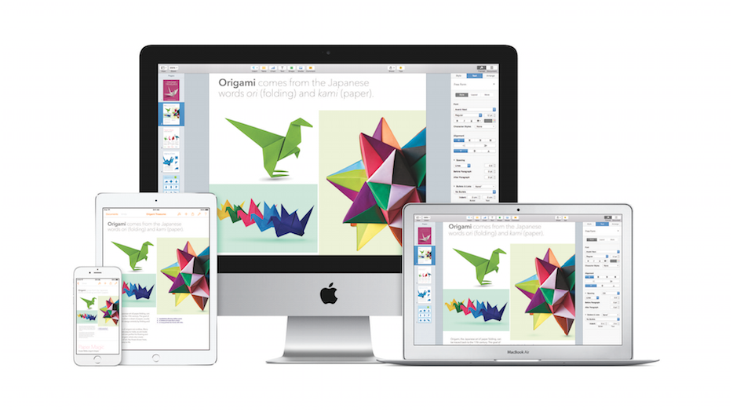\

### Characteristics

The first version came out in 2005 as a dual-purpose word processing and page-layout app; the new version puts more emphasis on word processing functions, but still retains some page-layout features.

- **Templates:** Pages features over 60 Apple-designed templates to help create documents, resumes, cards, posters, and more. 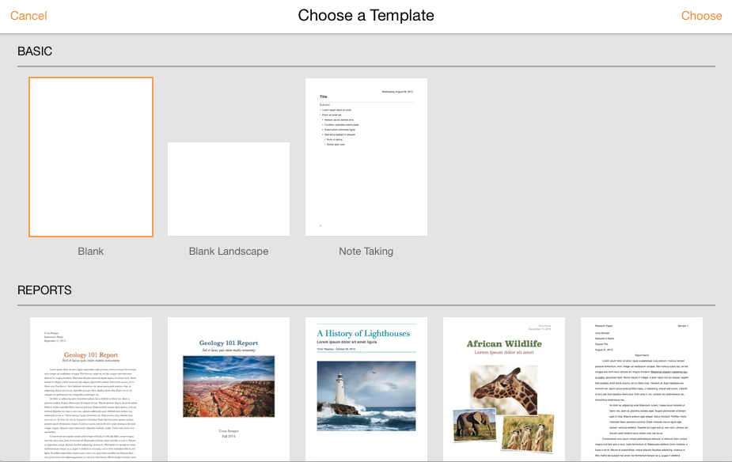\
- **Collaboration:** Users can invite over 100 people to share and collaborate on a document at the same time in the browser version of the app. Much like Google Docs, Pages displays each person’s cursor in the document as they’re working. A list of shared documents can be found in the document manager.
- **Security:** Protect documents by adding passwords to a file.
- **Editing:** Track document changes in real time as other collaborators edit.
- **Saving:** Documents created in Pages can be saved in Microsoft Word, Pages, PDF, and EPUB formats.
- **Hyperlinks:** When copying a URL into a document, Pages automatically inserts the hyperlink. No link button necessary.
- **Images:** Pages supports images up to 10MB and automatically wraps the surrounding text.

### Adaptations

Pages features attractive, easy-to-read fonts and graphics in typical Apple style. The control panel is located off to the right side, leaving the writing workspace clean and clutter free. Changing font features, line spacing, and alignment is a breeze with the control panel’s clearly defined sections.

Though this latest version of Pages puts more emphasis on word processing, the app still retains elements of a page layout app to elevate basic word documents. Image alignment guidelines, for example, are comparable to those found in InDesign.

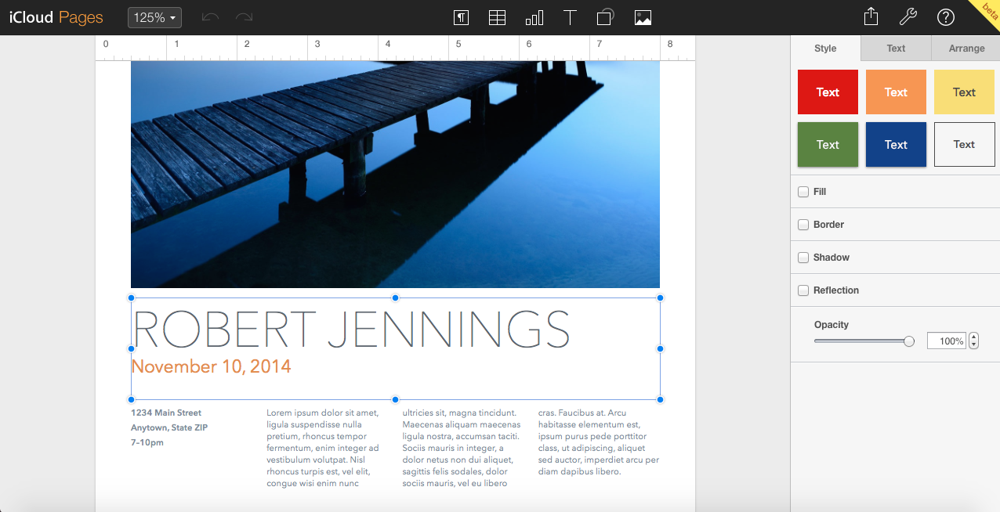\

Another bonus of the browser version is its help guide. Quick start hints appear in the document manager when the page first loads, much like those found in a mobile app. In a matter of seconds, users are quickly on their way to creating beautiful documents.

### Vulnerabilities

Owners of Macbooks purchased before 2013 will be quite disappointed to discover that the desktop version of the app still comes with the $19.99 price tag. The browser version is nearly identical to the desktop app, but without the capability to work on documents offline. Pages has received a complete overhaul since its predecessor (Pages ’09) and is currently missing a wide range of features. The breadth of color choices is a bit limiting, especially in comparison to Microsoft Word’s color wheel of options.

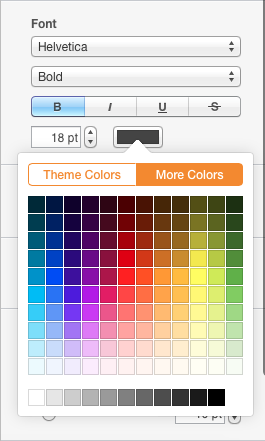\

Text box linking is also currently unavailable, but these features aren't necessarily needed to create flyers or posters. And, unlike Microsoft Word, the toolbar is not customizable. Pages is, in its current state, largely a “what you see is what you get” app.

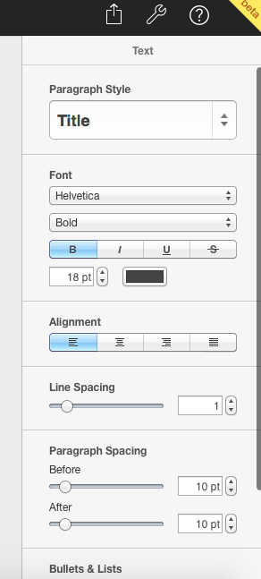\

One major flaw of the app is the inability to drag text from one location to another. Sure, users could copy and paste their way to better content organization, but why bother when one could simply select and drag? Adding this feature could help win over some Microsoft Word users.

On numerous occasions, the document manager stopped responding with the server. Changes were lost. Tears were shed. But this could very well be a problem with OS X Yosemite rather than Pages itself.

### Compatibility

Apple’s support forums and comment sections are exploding with strong opinions about the new Pages. Whether it’s loved or hated seems to depend on how much experience users had with the previous version.

Pages ’09 users: stay away from this app. At least for now. Many features from the previous version have changed locations or not been added, but Apple is likely to bring them back in future updates. Avid users of Microsoft Word or professional page layout programs like InDesign will be frustrated with the lack of control over certain features.

Others are delighted by the graphics and cross-platform capability. There’s even talk that the latest Pages is paving the way for a pro version of the app.  But, if users are looking for a cheap alternative to Microsoft Word or simply need a clean, non-distracting writing space, Pages is definitely a viable option.

### Observed In The Wild By:

Alicia Auhagen is a writer and artist interested in using her creative talents to produce work that promotes positive action and meaningful conversation. She currently works as a writer, photographer/videographer, and creative consultant for Miami University Communications and Marketing.

## Specimen 7: Scrivener
Alex Korman

\

- **Platform:** Mac, Windows
- **Use:** Novel writing and drafting
- **Cost:** Free 30-day trial (after which Scrivener 2.0 can be purchased), Mac $45 for regular license or $39.25 for education license, Windows $40 for regular license or $35 for education license, Mac-Windows bundle $69.95
- **Developer:** Keith Blout
- [Website](http://www.literatureandlatte.com/scrivener.php)

### Basic Knowledge

Scrivener is an easy-to-use writing platform that helps bring unorganized material together to create harmony. This writing platform is aimed towards all types of writers, including novelists, journalists, screenwriters, playwrights, and academics, who are looking to organize their writing, notes, or research. Although the user can complete final projects in Scrivener, this app is primarily a first draft tool; most writers choose to take drafts to their word processor of choice for final formatting.
Characteristics

- **Corkboard:** The corkboard is an organizational tool that stacks virtual index cards onto a virtual corkboard. These index cards can be grouped and associated with the text in the draft. By creating a new index card, the user is essentially making a new document. When the user moves to the document, the index card is displayed in the right-hand corner, showing the synopsis and what the user plans to write. This corkboard mode makes it easier to understand how each section of a project is broken up.
- **Outliner:** This mode works exactly like corkboard mode, with the ability to see titles and synopses in an outline form. In this format, users can edit text directly from the outline and even drag and drop items to restructure their work.
- **Scrivenings:** Scrivenings gives the user the ability to work on a manuscript as one long document in chapters, or in pieces as large or small as the user prefers. With this tool, novelists can work in separate chapters; screenwriters can work scene-to-scene or act-to-act. This feature breaks a long text into smaller sections with separate folders for easy organization, making the task easier to tackle.
- **Split Mode:** Split mode visually divides the document horizontally or vertically. This feature allows the user to view different parts of the same document or even place entirely different documents beside one another. Visuals such as images and PDF documents can be imported directly into the text and viewed alongside text as the user is writing.
- **Compile:** When the user is finished writing, this feature can be used to either bring the files together to print or export the written work to another program for final formatting. With this feature, the user can export the document as a PDF, Word document, plain text (.txt), web page (.html), EPUB (.epub), e-book (.fdx), etc. These files are then compiled into one document for final formatting.
- **Templates:** The user can choose from the following project templates: fiction, non-fiction, scriptwriting, poetry and lyrics, and miscellaneous. The software also offers a blank template to start from scratch.
- **Full-screen Mode:** In this mode, all the tools on the page disappear and the background goes black. This mode is suited for writing long pieces because it eliminates distractions.
- **Binder:** This section shows all of the user’s folders and documents.
- **Draft Folder:** This folder is where the actual manuscript or text is compiled.
- **Color Coding:** To help make complicated outlines easier to read, the user has the option of color-coding the text by section or chapter.

### Adaptations

Scrivener gives users the opportunity to structure their document the way they prefer. Through the corkboard and outliner modes, writers are able to organize their document by dragging different material from one index card to the next. Here, users are the designers; they have the ability to outline or write as they please.

Scrivener also offers easy file conversion. When it comes time to compile files and export a document, Scrivener can not only convert files into Word documents and PDFs, but can also convert files into .epub or .mobi formats for e-books. This conversion feature eliminates the need for a third party software to convert the manuscript.

Another unique benefit offered by Scrivener is the app’s flexible free trial. Scrivener’s free trial period lasts thirty days, but the trial only counts the days that the app is in use. For example, if the user only opens the app once per week, they will have free access to the software for thirty weeks. This gives the user the opportunity to fully understand the app before deciding to purchase a licensed version.

### Vulnerabilities

With all the different features available in Scrivener, it takes some time to learn and feel comfortable using the app. On the plus side, Scrivener has many tutorial videos on their website to show beginners how to get started. Additionally, although the software is available for both Mac and Windows, the software seems to be intended more for Mac use. For example, the Windows version lacks the sync button, which allows the user to save files. This is definitely a crucial feature for writers who want to know that their writing is saved at all times.

### Compatibility 

Scrivener’s appeal comes from its ability to offer a variety of creative privileges, especially for novel writers. The software is a powerful first draft tool that focuses on structuring long, complex documents and controls formatting to guide users through their first draft smoothly. Most writing platforms want writers to understand the value of their software compared to Microsoft Word, and this software gives writers the opportunity to organize their thoughts without aimlessly writing. For writers in search of a unique, intuitive writing platform, Scrivener is a must-see, must-use app.

### Observed In The Wild By:

Alex Korman is a Professional Writing major with minors in Creative Writing and Neuroscience. She works with Miami's Career Services editing their promotional/marketing material and is also a member of the Miami University Dance Team.

## Specimen 8: Write or Die 2
Lauren Kraus

\

- **Platform:** web (free version); Mac, Windows, Linux (full version)
- **Use:** Novel writing, creative writing, correcting bad writing habits
- **Cost:** Free web version, full version $20 (students, teachers, and previous purchasers can receive a discount code and pay $15)
- **Developer:** Jeff Printy (aka Dr. Wicked)
- [Website](http://writeordie.com/)

### Basic Knowledge 

There isn’t a writer alive who hasn’t felt the frustration of writer’s block. The flat white expanse of the empty page can bring even the most inspired creative endeavor to a standstill. But what if there were an incentive to fill that wasteland with words?

Write or Die 2, available for Windows, Mac, and Linux systems, was created to help authors eliminate writer’s block by punishing procrastination and rewarding accomplishments. With this application, users are able to set a word count goal and a time limit for themselves and get to work. The app is customizable to fit the user’s needs and offers visual and audio stimuli as a means of inspiring (or threatening) the user to press on in the face of writer’s block.

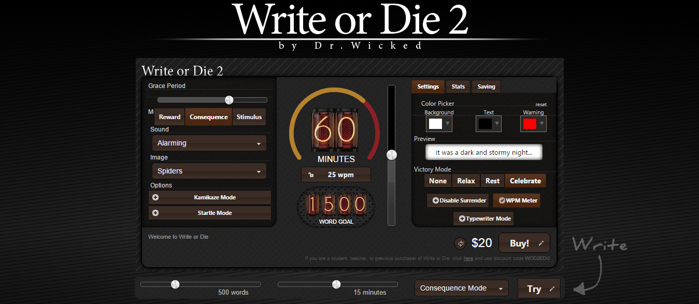\
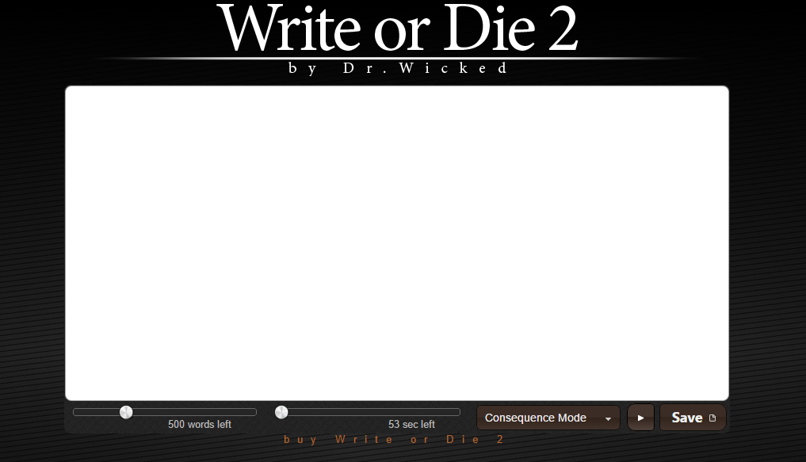\

### Characteristics 

Write or Die 2 users have the option of customizing each of the following features to match their writing goals. In addition to these customizable features, the app also offers a reward mode and three different punishment modes, each with their own consequences for neglecting the page.

- **Word Counter:** As is standard with most writing applications, Write or Die 2 tracks the numbers of words the user has written. This word counter can be used to gauge how much the user has written and how much further they need to go in order to reach the goal they have set for themselves. In addition to tracking the user’s progress, the full version of the app also provides stats for the user—average words per minute, an all-time word count, and even high scores. When the user meets their word count goal they have the option to enable Victory Mode, which grants them a brief reprieve from facing any consequences for inactivity.
- **Punishment/Reward System:** Write or Die 2 operates according to a punishment/reward system. If the user’s goal is met, the user is rewarded. If the user’s goal is not met, the user is punished. These positive and negative consequences are implemented in order to encourage the user to develop dedicated writing habits. When the user’s output slows or stalls, the screen may fade to red as a warning for impending punishment. \
- **Reward Mode:** Reward Mode is the newest feature of Write or Die 2 and marks a noticeable change in the app’s potential uses (the original Write or Die app did not offer any sort of reward system and operated solely on a punishment system). Filling a page can feel overwhelming at times, but Reward Mode gives the user something to look forward to at the end of the road. This mode gives the user positive reinforcement whenever a writing goal is met, and this positive reinforcement is customizable; the user can choose to be shown images of cute bunnies, a field of flowers, a delicious ice cream sundae—anything their heart desires. Everything in moderation, of course; this mode includes an incentive frequency slider that adjusts how often the user is rewarded for their hard work.
- **Stimulus Mode:** Stimulus Mode allows the user to create a writing environment geared towards concentration. The app’s background image can be changed from the standard white to something more pleasant, such as a beach or a forest. Neutral, soothing background sounds—options ranging from the purr of a cat to classic white noise—help to fully immerse the user in their environment. Users can also create a custom playlist from their own personal music library as an added motivator to keep writing. The catch? When the user stops writing, the soothing environment disappears.
- **Consequence Mode:** Consequence Mode is the heart of Write or Die 2; if the user stops writing, they face negative consequences in the form of annoying sounds or startling images. The unpleasantness is randomized to give the user a unique jolt each time they stall. Consequence Mode can be further customized and set to either Kamikaze Mode or Startle Mode. 
    - In Kamikaze Mode, if the user stops writing the program begins to delete vowels from words one at a time until the user’s progress resumes (this is a modification from the previous version of the app in which entire words were deleted as punishment for idleness). 
    - Perhaps the cruelest of all the available punishment modes, Startle Mode allows the user to disable the warning color that precedes punishments. 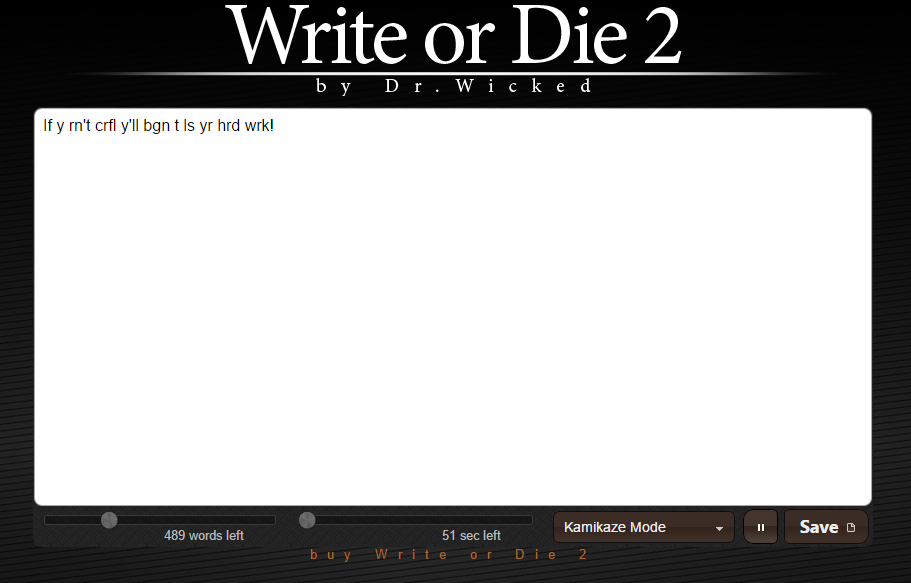\

### Adaptations

The appeal of using Write or Die 2 comes from its use of visual and audio elements to praise or punish the user. Users can decide what color the screen and the text will be, as well as what color the screen will fade to when a punishment is imminent. While the previous version of the app only offered color changes and alarming sounds as punishments, this updated version gives users the option to be presented with cute or frightening images depending on their progress. Users can also select Typewriter Mode to simulate an old-school typewriter—this means no deleting and no arrow key navigation within the text box.

This app is also appealing because it can be very specifically tailored to the user’s needs. Users are able to set up detailed parameters for their session that allow them to focus on generating the words rather than perfecting them. This type of writing environment encourages users to increase their output by following the “throw it up, then clean it up” method—get as much raw text as possible onto the page, and wait until nothing more can be said before going back and tidying up.

### Vulnerabilities 

Although this app is useful for short, energy-filled bursts of writing, Write or Die 2 may not be everyone’s first choice for a primary writing space. While the punishment system does help writers push past the tedium of constant self-editing to get into the meat of their writing, the environment it creates is undeniably stressful. It can be difficult to get into the right mental space for writing with the threat of emergency sirens and spiders hanging over one’s head.

One of the biggest complaints about earlier versions of Write or Die 2 is that it did not include an in-app save feature—meaning any progress made in the app would have to then be copied from the app and pasted somewhere else—which deterred potential users, but this has since been remedied. The full version of the app now has an autosave feature that allows users to command the app to automatically save their work at set intervals, giving users the freedom to fully immerse themselves in their writing without fear of losing their work.

But the problem with this new autosave feature—and most of the features that have been discussed so far—is that it is only available in the full version of the app. The free online version of Write or Die 2 only allows users to set a word count goal and a time limit, and Reward Mode is not an option. Though the full version offers a more in-depth configuration of the goal-based punishment and reward systems, it is also rather costly.

### Compatibility 

Write or Die 2 is a great tool for writers who have trouble actually sitting down to write. The app doesn’t tolerate being ignored, and users quickly learn to avoid distractions for fear of the consequences. The app also doesn’t allow for self-editing during the writing process; many writers are tempted to agonize over every phrase before moving on, but Write or Die 2 trains users to work hard to write as much as they can and then revise later.

Writers who participate in National Novel Writing Month—also called NaNoWriMo—each November might also find this app very useful. Successful completion of the goal of NaNoWriMo—to write a 50,000-word novel in a month—necessitates working at a fast pace, and Write or Die 2 is suited for projects that demand a great deal of progress be made as quickly as possible.

Even writers who have no specific project to work on have something to gain from this app. Write or Die 2 can be used to bang out quick rough drafts of academic papers, scenes from a story in the works, or even for quick brainstorming or warm-up exercises. Writers who function best under pressure and are motivated by rewards or punishments owe it to themselves to give Write or Die 2 a test run.

### Observed In The Wild By:

Lauren Kraus is a Creative Writing and Women's, Gender, and Sexuality double major who specializes in busting binaries. She is an amateur blogger, a recreational feminist, and an aspiring editor. Her life goal is to pet every dog.

